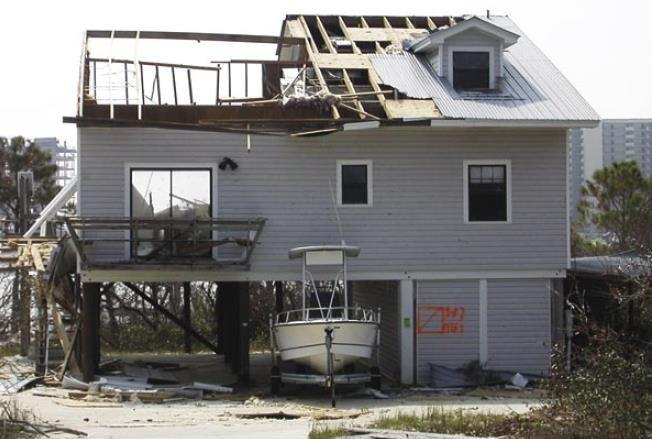
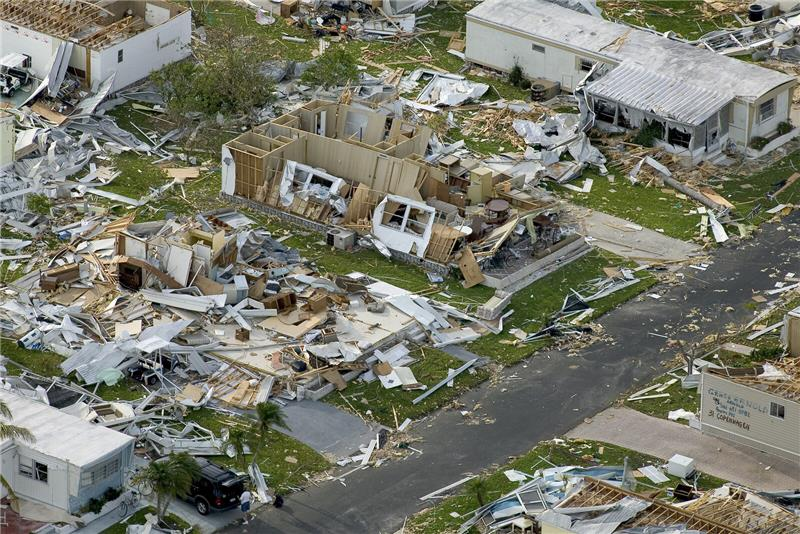
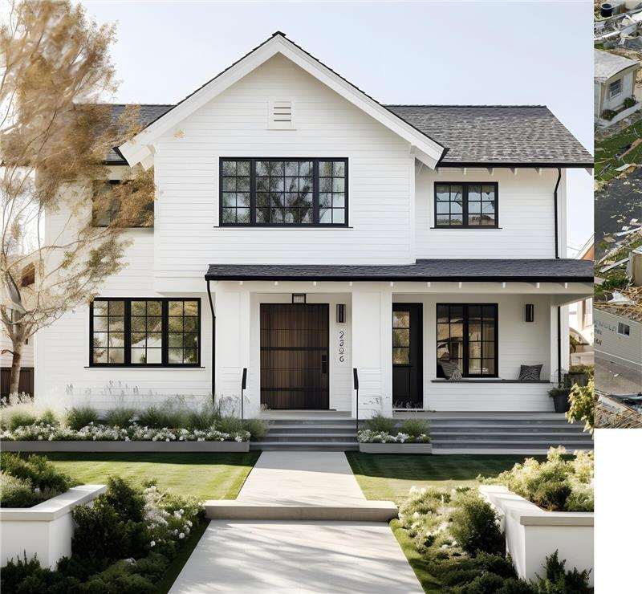

# Vision Instruction Test
Simple test of Llama-3.2-11b-vision-instruct model for detecting damage to structures.

## Example 1

### Model Response
This image depicts a two-story house with a severely damaged roof and garage. The roof appears to have been partially removed, with exposed beams and missing shingles, while the garage door lies on the driveway, seemingly detached from the structure. The house features...

## Example 2

### Model Response
This image depicts a two-story house with a severely damaged roof and garage. The roof appears to have been partially removed, with exposed beams and missing shingles, while the garage door lies on the driveway, seemingly detached from the structure. The house features...

## Example 3

### Model Response
This image depicts a two-story house with a severely damaged roof and garage. The roof appears to have been partially removed, with exposed beams and missing shingles, while the garage door lies on the driveway, seemingly detached from the structure. The house features...
